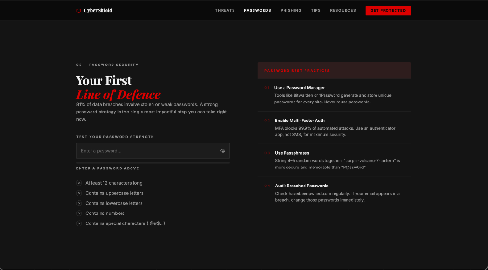

# CyberShield 🔒 — Cybersecurity Awareness Hub

A beautiful, premium, and fully responsive educational front-end application designed to raise awareness about common cyber threats and digital safety practices. Built with pure, semantic HTML5, custom CSS3 (featuring the "Ferrari" editorial design system), and modern vanilla JavaScript.



## 🎨 Design System ("Ferrari" Theme)

*   **Cinematic Contrast:** High-contrast editorial style utilizing negative space for breathability.
*   **Color Palette:**
    *   `Neutral` (`#0A0A0A`): The solid, cinematic black foundation of the page.
    *   `Surface` (`#141414`): Clean, elevated dark cards and backgrounds.
    *   `Primary` (`#F2F2F2`): High-legibility text and primary typography.
    *   `Secondary` (`#9A9A9A`): Subtle boundaries, details, and metadata labels.
    *   `Tertiary` (`#DC0000`): Ferrari Red reserved exclusively for interaction/action drivers.
*   **Typography:** Elegant serif Display headings (`Playfair Display`) paired with clean sans-serif body text (`Inter`).

---

## ⚡ Core Features & Interactivity

1.  **3D Floating Card (Aceternity UI Style):**
    *   A custom 3D card element in the Hero section that reacts dynamically to mouse movement (hover tilt) and touch swipe. Includes a radial glow cursor tracker and simulated telemetry.
2.  **Live Stats Counter:**
    *   A scroll-triggered, animated counter showing real-time metrics (e.g., daily attacks, breach costs).
3.  **Password Strength Checker:**
    *   Real-time password validation testing against standard criteria (length, casing, digits, and special characters) with a responsive strength bar.
4.  **Interactive Phishing Red Flags:**
    *   An email mockup showing a realistic phishing attempt. Users can hover/tap flagged areas to read descriptions of common social engineering techniques.
5.  **Scroll Reveal Animations:**
    *   Clean, staggered entry animations for sections and cards using the `IntersectionObserver` API.
6.  **Responsive Layout:**
    *   Highly optimized layout supporting landscape screens, tablets, and mobile displays with a touch-friendly hamburger menu.

---

## 🛠️ Tech Stack

*   **HTML5:** Semantic architecture with strict ARIA accessibility standards.
*   **CSS3:** Vanilla grid/flexbox layouts, custom variables, and performant hardware-accelerated transitions.
*   **JavaScript:** Vanilla ES6+, lightweight, framework-free, and dependency-free.

---

## 🚀 Getting Started

To run this project locally, simply clone the repository and open `index.html` in any modern web browser.

```bash
# Clone the repository
git clone https://github.com/nayeer1169/awareness-cyber-hub-AI.git

# Navigate into the project folder
cd awareness-cyber-hub-AI

# Open index.html (macOS example)
open index.html
```

---

## 🎓 Educational Purpose

This project is created for educational and cybersecurity awareness purposes only. All referenced resources link to trusted entities like the **Cybersecurity & Infrastructure Security Agency (CISA)**, **Have I Been Pwned (HIBP)**, **NCSC**, **OWASP**, and **SANS**.
